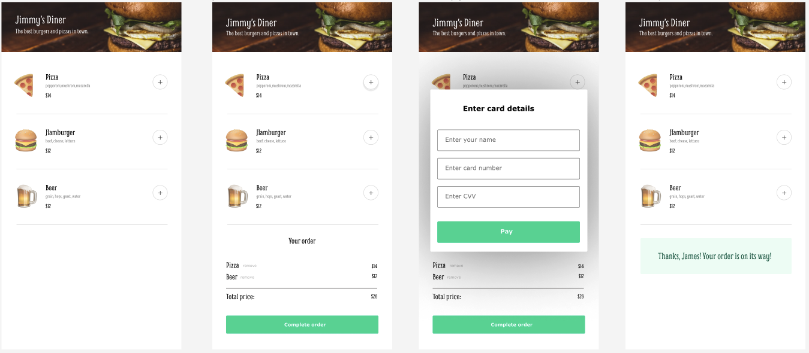

## Restaurant Ordering App

### The challenge:

A simple restaurant ordering app built with HTML/CSS/JavaScript.

### Screenshot



### Code to keep in mind

Using box-shadow to make the modal the focus point:

```css
.payment-modal {
  position: fixed;
  right: 0;
  left: 0;
  top: 0;
  bottom: 0;
  margin: auto;
  height: 400px;
  width: 400px;
  border-radius: 5px;
  box-shadow: 0 0 0 50vmax rgba(0, 0, 0, 0.5);
  background-color: #fff;
  padding: 10px;
}
```

```js
form.addEventListener("submit", (e) => {
  e.preventDefault();
  const formData = new FormData(form);
  const userName = formData.get("customer-name");

  let thankYou = "";

  thankYou = `
        <p>Thank you, ${userName}! <br> Your order is on its way!</p>
    `;

  thankYouMsg.innerHTML = thankYou;

  thankYouMsg.classList.remove("hidden");
  paymentModal.classList.add("hidden");
  orderContainer.classList.add("hidden");
});
```
